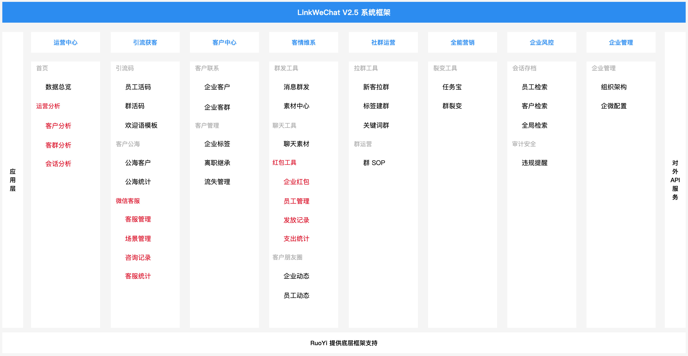

<p></p>
<p></p>


<div align="center">

[](https://gitee.com/LinkWeChat/link-wechat/stargazers)
[](https://gitee.com/LinkWeChat/link-wechat/members)
[](https://www.yuque.com/linkwechat/help/ci1n9p)
[](https://gitee.com/LinkWeChat/link-wechat/blob/master/LICENSE)
[](https://portal.mulanos.cn//)

[官方网站](https://www.linkwechat.cn/#/d) | [在线演示](http://demo.linkwechat.cn/) | [最新动态](https://www.yuque.com/linkwechat/help/mn63mx) 

[项目手册](https://www.yuque.com/linkwechat/help) | [用户手册](https://docs.qq.com/pdf/DZXFPdEN4ckVBVU1H) | [常见问题](https://www.yuque.com/linkwechat/help/qk5gl6) | [需求收集表](https://docs.qq.com/sheet/DZWxGU0JGVFRVdWZV)


</div>

<p></p>
<p></p>
<p></p>
<p></p>

---

 **<p align="center">【📣最近更新】LinkWeChat V2.5 正式公测啦，新增运营中心、微信客服、红包工具功能，如有问题欢迎提交 Issue，项目组将光速修复，<a href="http://demo.linkwechat.cn/" target="_blank">点击立即体验~</a></p>** 

 **<p align="center">【📣特别说明】V2.5 版本中红包工具模板涉及企业支付，需要多轮封闭测试后逐步开放，具体源码是否开源酌情而定</p>** 

 **<p align="center">【📣最新动态】LinkWeChat 2021 年度开源数据报告来啦，<a href="https://gitee.com/LinkWeChat/link-wechat/blob/master/readme_pic/2021%E5%B9%B4%E6%8A%A5%E6%9C%80%E7%BB%88V2.jpg" target="_blank">点击查阅~</a></p>** 

 **<p align="center">如果您觉得我们的开源项目很有帮助，请点击 :star: Star 支持 LinkWeChat 开源团队:heart:</p>** 

 **<p align="center">还有什么想要的产品功能/技术支持/说明文档/友好的建议或意见，<a href="https://docs.qq.com/sheet/DZWxGU0JGVFRVdWZV" target="_blank">点击告诉我们~</a></p>** 

---

# 版权声明

开源不代表免费，LinkWeChat 遵循 [GPL-3.0](https://gitee.com/LinkWeChat/link-wechat/blob/master/LICENSE) 开源协议发布，并提供技术交流学习，但**绝不允许修改后和衍生的代码做为闭源的商业软件发布和销售！** 如果需要将本产品在本地进行任何附带商业化性质行为使用，**请联系项目负责人进行商业授权**，以遵守 GPL 协议保证您的正常使用。

目前在国内 GPL 协议**具备合同特征，是一种民事法律行为** ，属于我国《合同法》调整的范围。LinkWeChat 项目团队保留一切诉讼权利。

[相关案例：违反 GPL 协议赔偿 50 万，国内首例!](https://mp.weixin.qq.com/s/YQ6sNjbDS-P7BViLZIsaoA)

LinkWeChat 开源团队拥有对本开源协议的最终解释权。

# 一、 关于 LinkWeChat

## 1.1 介绍

> LinkWeChat, Link to WeChat.

基于人工智能的企业微信 SCRM 系统——LinkWeChat基于企业微信开放能力，不仅集成了企微基础的客户管理和后台管理功能，而且通过引流获客、客情维系、社群运营等灵活高效的客户运营模块，让客户与企业之间建立强链接关系，同时进一步通过多元化的客户营销工具，帮助企业提高客户运营效率，强化营销能力，拓展盈利空间，是企业私域流量管理与营销的综合解决方案。

[更多 LinkWeChat 的故事](https://www.yuque.com/linkwechat/help/dsatfs)

## 1.2 能力

LinkWeChat SCRM 基于企业私域流量营销闭环，遵从获取新客到管理并维护客户，再到建立社群进行客户营销，最后在营销过程中再次获取新客的循环流程。


整个系统共分为八大模块：

*   **运营中心** ：客户、客群、会话等全功能数据报表，数据一目了然；
*   **引流获客** ：活码、群活码、公海、客服等多渠道引流，实现精准获客；
*   **客户中心** ：助力企业搭建私域流量池，高效运营客户；
*   **客情维系** ：企业客户运营精细化，朋友圈、红包工具提高客户活跃度；
*   **社群运营** ：客群运营场景全覆盖，快速拉群；
*   **全能营销** ：提供多类型、多场景客户营销工具；
*   **企业风控** ：会话合规存档，敏感内容全局风控；
*   **企业管理** ：组织架构、自建应用全融合，实现“一个后台”；

V2.0 详细功能清单：

[LinkWeChat 社区版 V2.0 详细功能清单](https://docs.qq.com/sheet/DZUZhVkZybUVLWEZV)

## 1.3 优势

LinkWeChat 基于企业微信从服务内部到对外全面开放能力，可为电商、零售、教育、金融等垂直场景提供企微私域管理基础架构，主要优势有：

* 全面对接企微开放 API，无需重复对接，快速上手
* 二次整合封装企微 API，避免重复踩坑
* 采用主流 Java 架构，具备高拓展性、灵活性，避免 PHP 架构的缺点
* 对外提供内部 API，低成本二次开发
* 基于 NLP 对会话内容进行智能语义分析，实现标签自动化、告警自动化


## 1.4 愿景

LinkWeChat 不做私域营销专家，而是通过开源让每个企业都是自己的私域流量营销专家：

* 集成企业微信基础能力，拿来即用
* 针对垂直行业提供一站式营销解决方案
* 开放自身平台能力，让更多的开发者参与进来
* 与企业微信共同助力企业数字化转型

# 二、关于项目

## 2.1 在线体验

演示地址：[http://demo.linkwechat.cn/](http://demo.linkwechat.cn/)

演示账号/密码：Wecome/123456

 _（注意：演示环境已屏蔽管理权限和相关操作）_ 

## 2.2 技术栈

本项目基于 [RuoYi-Vue](https://gitee.com/y_project/RuoYi-Vue?_from=gitee_search) 后台开发框架，感谢 [RuoYi-Vue](https://gitee.com/y_project/RuoYi-Vue?_from=gitee_search) 的开源。

 **前端技术栈** 

| 技术栈 | 介绍 | 地址 |
|:-:|:-:|:-:|
| Vue | 渐进式 JavaScript 框架  |  https://cn.vuejs.org/  |
|  Vuex	|专为 Vue.js 应用程序开发的状态管理模式	|https://vuex.vuejs.org/zh/  |
|Vue Router|	Vue.js 官方的路由管理器|	https://router.vuejs.org/zh/
|Vue CLI	|基于 Vue.js 进行快速开发的完整系统	|https://cli.vuejs.org/zh/guide/
|axios|	易用、简洁且高效的 Http 库	|http://www.axios-js.com/zh-cn/
|Element-UI	|基于 Vue 2.0 的桌面端组件库|	https://element.eleme.io/#/zh-CN
|ES6|	JavaScript 语言的下一代标准|	https://es6.ruanyifeng.com/


 **后端技术栈** 
| 技术栈 | 介绍 | 地址 |
|:-:|:-:|:-:|
|Spring Boot	|快捷创建基于 Spring 的生产级应用程序|	https://spring.io/projects/spring-boot
|MyBatis-Plus|	MyBatis 增强工具	|https://mp.baomidou.com/
|JWT|	轻量级身份认证规范|	https://jwt.io/introduction
|Spring Security	|基于 Spring 的强大且高度可定制的身份验证和访问控制框架	|https://spring.io/projects/spring-security/

## 2.3 项目结构

**后端结构** 

```
com.linkwechat     
├── common            // 工具类
│       └── annotation                    // 自定义注解
│       └── config                        // 全局配置
│       └── constant                      // 通用常量
│       └── core                          // 核心控制
│       └── enums                         // 通用枚举
│       └── exception                     // 通用异常
│       └── filter                        // 过滤器处理
│       └── utils                         // 通用类处理
├── framework         // 框架核心
│       └── aspectj                       // 注解实现
│       └── config                        // 系统配置
│       └── datasource                    // 数据权限
│       └── interceptor                   // 拦截器
│       └── manager                       // 异步处理
│       └── security                      // 权限控制
│       └── web                           // 前端控制
├── linkwe-generator   // 代码生成
├── linkwe-quartz      // 定时任务
├── linkwe-system      // 系统代码
├── linkwe-admin       // 后台服务
├── linkwe-ui          // 页面前端代码
├── linkwe--wecom      // 企业微信功能

```

**前端结构** 

```
├── build                      // 构建相关  
├── bin                        // 执行脚本
├── public                     // 公共文件
│   ├── favicon.ico            // favicon图标
│   └── index.html             // html模板
├── src                        // 源代码
│   ├── api                    // 所有请求
│   ├── assets                 // 主题 字体等静态资源
│   ├── components             // 全局公用组件
│   ├── directive              // 全局指令
│   ├── layout                 // 布局
│   ├── router                 // 路由
│   ├── store                  // 全局 store管理
│   ├── utils                  // 全局公用方法
│   ├── views                  // view
│   ├── App.vue                // 入口页面
│   ├── main.js                // 入口 加载组件 初始化等
│   ├── permission.js          // 权限管理
│   └── settings.js            // 系统配置
├── .editorconfig              // 编码格式
├── .env.development           // 开发环境配置
├── .env.production            // 生产环境配置
├── .env.staging               // 测试环境配置
├── .eslintignore              // 忽略语法检查
├── .eslintrc.js               // eslint 配置项
├── .gitignore                 // git 忽略项
├── babel.config.js            // babel.config.js
├── package.json               // package.json
└── vue.config.js              // vue.config.js
```

## 2.4 项目部署

点击下方链接进入官方语雀帮助手册查看项目部署方式：

[如何快速部署 LinkWeChat](https://www.yuque.com/linkwechat/help/gpod7i)

建议服务器最低配置：

| 类型 | 配置 |
|:-:|:-:|
|操作系统|CentOS8.2|
|CPU|4核|
|内存|8G|
|带宽|5M|
|硬盘|100G|

# 三、常见问题

由于 LinkWeChat 项目基于企业微信官方第三方应用开发文档，所以请各位小伙伴在学习和使用 LinkWeChat 之前， **务必仔细了解并熟悉** 官方 API 已有功能。

[企业微信-企业内部开发-API 文档](https://open.work.weixin.qq.com/api/doc/90000/90003/90556)

**常见问题列表** 

[1.有哪几种部署方式？](https://www.yuque.com/linkwechat/help/bww8vd)

[2.数据库为什么 Group By 查询报错？](https://www.yuque.com/linkwechat/help/babnva)

[3.项目每个分支的作用是什么？](https://www.yuque.com/linkwechat/help/ztbre1)

[4、运行项目必须配置 Nacos 吗？](https://www.yuque.com/linkwechat/help/yivnfb)

[5、项目启动时为什么报错？](https://www.yuque.com/linkwechat/help/cepvgv)

[6、如何使用 Docker 进行部署？](https://www.yuque.com/linkwechat/help/ffi7bu)

[7、图片为什么不显示或者裂开？](https://www.yuque.com/linkwechat/help/ggqnhb)

点击下方链接进入官方语雀帮助手册查看常见问题的相关描述及更多帮助：

[帮助手册——常见问题](https://www.yuque.com/linkwechat/help/qk5gl6)

# 四、最近更新

## V2.5 更新日志

LinkWeChat V2.5 版本主要围绕运营中心、引流获客、客情维系等模块进行升级，主要的升级内容如下：

- [x] 首页全新升级为运营中心，各项运营数据快捷查看；
- [x] 运营中心-新增客户分析，全维度查看客户数据；
- [x] 运营中心-新增客群分析，全维度查看客群成员数据；
- [x] 运营中心-新增会话分析，全维度查看客户联系、客群联系以及会话存档数据分析；
- [x] 引流获客-新增微信客服，打通微信全渠道客服生态；
- [x] 微信客服-新增客服管理，快捷创建客服，支持智能助手；
- [x] 微信客服-新增场景管理，快捷接入多渠道客服；
- [x] 微信客服-新增咨询记录，查看各渠道客服咨询客户及咨询记录；
- [x] 微信客服-新增客服统计，支持场景及咨询分析，多维度查看客服数据；
- [x] 客情维系-新增红包工具，侧边栏快捷发送企业红包；
- [x] 红包工具-新增企业红包，快捷创建客户/客群红包模板，一键发送；
- [x] 红包工具-新增员工管理，快捷设置员工限额，查看员工发送数据；
- [x] 红包工具-新增发放记录，查看企业员工发放红包数据统计；
- [x] 红包工具-新增支出分析，查看企业红包支出统计数据；
- [x] 企业管理-企微配置升级，新增微信客服及微信支付配置；
- [x] 其余各模块细节调优。

 **【特别说明：V2.5版本中红包工具模板涉及企业支付，需要多轮封闭测试后开放。具体源码是否开源酌情而定】** 



## V2.0 更新日志

LinkWeChat V2.0 主要围绕引流获客、客户中心、客情维系等模块进行升级，主要的升级内容如下：

- [x] 系统菜单重新整合，结构更加清晰；
- [x] 引流获客-员工活码支持分组；
- [x] 引流获客-员工活码支持自动排班；
- [x] 引流获客-员工活码支持多类型欢迎语；
- [x] 引流获客新增客户公海模块，支持一键分配自主添加；
- [x] 引流获客-欢迎语升级为欢迎语模板，支持多类型欢迎语个性化配置；
- [x] 客户中心-企业客户全新改版，支持查看多人跟进内容；
- [x] 客户中心-企业客群支持标签管理；
- [x] 客户中心-企业标签支持客群标签管理；
- [x] 客情维系-消息群发全新改版，支持多类型群发类型；
- [x] 客情维系-消息群发支持查看员工、客户维度的群发详情；
- [x] 客情维系-素材中心新增链接、小程序等多类型；
- [x] 客情维系-新增朋友圈模块，支持查看企业/个人动态；
- [x] 客情维系-支持企业发表朋友圈；
- [x] 社群运营-各模块细节调优；
- [x] 企业管理-企微配置全新改版，支持多种配置方式。

# 五、奖项荣誉

凭借着出色的产品能力和专业的技术能力，LinkWeChat 在 Gitee 开源社区年度评选活动中荣获“2020 年度 GVP最有价值开源项目”、“2020 年开源中国最佳人气项目”两个重量级奖项。


目前 LinkWeChat 已成功加入木兰开源社区孵化项目，得到了更加专业的技术支持与相关知识产权扶持，未来将会以更加严谨规范的专业能力服务各企业与行业。


# 六、联系我们

如果你想加入我们的开源交流群，请扫码添加 LinkWeChat 项目作者，加入群聊：


如果你有任何 LinkWeChat 产品上的想法、意见或建议，或商务上的合作需求，请扫码添加 LinkWeChat 项目团队进一步沟通：


# 七、捐赠支持

## 7.1 来一杯卡布奇洛

如果您觉得我们的开源项目 `LinkWeChat` 对您有帮助，那就请项目开发者们来一杯卡布奇诺吧！当前我们接受来自于**微信**、**支付宝**或者**码云**的捐赠，请在捐赠时备注自己的昵称或附言。

您的捐赠将用于支付该项目的一些费用支出，并激励开发者们以便更好的推动项目的发展，同时欢迎捐赠**公网服务器**用于提高在线演示系统体验。


## 7.2 长期捐赠

如果您是企业的经营者并且有计划将 `LinkWeChat` 用在公司的经营产品中，欢迎进行长期捐赠。长期捐赠有商业上的益处有：

* 积极响应，快速维护，及时更新；
* 企业名称、Logo 及官网链接将长期展示在开源仓库、`LinkWeChat` 官网及宣发材料中；
* 捐赠金额同比例抵扣未来 `LinkWeChat` 的付费产品价格。

如果您对长期赞助 `LinkWeChat` 团队感兴趣，或者有其他好想法，欢迎联系开发团队微信 `sxjiangdongqin`，或发送邮件到 iamxiarui@foxmail.com。

## 7.3 捐赠记录


`LinkWeChat` 全体开发团队感谢以下全部小伙伴们的赞助（排名不分先后）：

|   昵称   |  金额   | 渠道 |        时间         |        附言        |
| :------: | :-----: | :--: | :-----------------: | :----------------: |
|   yang   | ￥10.00 | 码云 | 2021-02-22 22:08:59 | 感谢您的开源项目！ |
| 水库浪子 | ￥1.00  | 码云 | 2021-02-22 22:09:03 | 感谢您的开源项目！ |
|     楼*     |   ￥166.60      | 微信     |       2021-02-22 22:27:25              |     希望这个好项目能长久发展               |
|     joygezxp     |   ￥66.60      | 微信     |       2021-02-22 22:39:41              |     愿项目一路666               |
|     iamxiarui     |   ￥10.00      | 微信     |       2021-02-22 22:37:52              |     坚持开源不容易               |
|     godricV     |   ￥10.00      | 微信     |       2021-02-22 22:28:55              |     感谢您的开源项目！               |
|     *标     |   ￥20.00      | 微信     |       2021-03-05 16:03:19              |     感谢您的开源项目！               |
|     *涯     |   ￥30.00      | 微信     |       2021-03-09 12:14:02              |      加油，感谢开源！               |
|     *魂     |   ￥30.00      | 微信     |       2021-03-11 10:52:47              |       感谢开源供大家学习               |
|     *J     |   ￥10.00      | 微信     |       2021-03-12 14:20:22              |       感谢开源供大家学习               |
|     杨*源     |   ￥10.00      | 码云     |       2021-03-23 11:07:22              |       期待月底的大更新               |
|     骆*升     |   ￥66.66      |  支付宝     |       2021-03-23 11:31:58              |       感谢开源供大家学习               |
|     曲*旭     |   ￥20.00      |   码云     |       2021-03-23 11:31:58              |       感谢您的开源项目！               |
|     郑*     |   ￥ 50.00      |  码云     |       2021-03-23 11:31:58      | 虽然之前做过类似的，还是感谢下开源和分享的奉献精神       |
|     *喵     |   ￥  66.00      |   微信     |       2021-03-24 11:06:31      | 感谢您的开源项目！       |
|     q*s     |   ￥ 50.00      |  微信     |       2021-03-29 19:57:49      | 感谢您的开源项目！       |
|     *海     |   ￥  1.00      |  微信     |       2021-03-30 10:47:03      | 感谢您的开源项目！       |
|     m*r     |   ￥ 50.00      |  微信     |       2021-03-30 17:55:30      | 感谢您的开源项目！       |
|     *祺     |   ￥ 20.00      |  支付宝     |       2021-03-30 19:03:59      | 感谢您的开源项目！       |
|     *桥     |   ￥  66.66      |  支付宝     |       2021-04-07 16:38:31      |  祝项目一路 666       |
|     *力     |   ￥  66.00      |  微信     |       2021-04-09 10:30:11      |   支持开源       |
|     *生     |   ￥  66.00      |  微信     |       2021-04-15 21:36:01      |   支持开源       |
|     Q*N     |   ￥  10.00      |  微信     |       2021-04-19 20:24:11      |   感谢分享       |
|     大*k     |   ￥  10.00      |  微信     |       2021-04-22 12:25:02      |   感谢您的开源       |
|     J*s     |   ￥  10.00      |  微信     |       2021-05-19 17:33:10      |   感谢您的开源       |
|     *茶     |   ￥  10.00      |  微信     |       2021-05-17 20:46:05      |   感谢您的开源       |
|     悟空     |   ￥   500.00      |   支付宝     |       2021- 11-17 11:05:05      |   感谢您的开源       |


`LinkWeChat` 全体开发团队感谢以下全部合作伙伴的服务器赞助（排名不分先后）：

|   公司/个人名称   |  服务器   | 
| :------: | :-----: | 
|   上海六感科技有限公司   | 八核 16G 服务器一台 |
|    Happy   | 两核 8G 服务器一台 |
|  平山阑槛倚晴空    | 两核 4G 服务器一台 |

## 7.4 社会价值

LinkWeChat 开源团队将目前所收项目捐赠全额捐出，仅尽绵薄之力，在此我们也感谢大家的捐赠和支持，希望河南尽早渡过难关。

同时也希望 LinkWeChat 不仅能为国内开源社区建设做一点贡献，也能为社会产生一些价值。


---

 **<p align="center">如果您觉得我们的开源项目很有帮助，请点击 :star: Star 支持 LinkWeChat 开源团队:heart:</p>** 

---