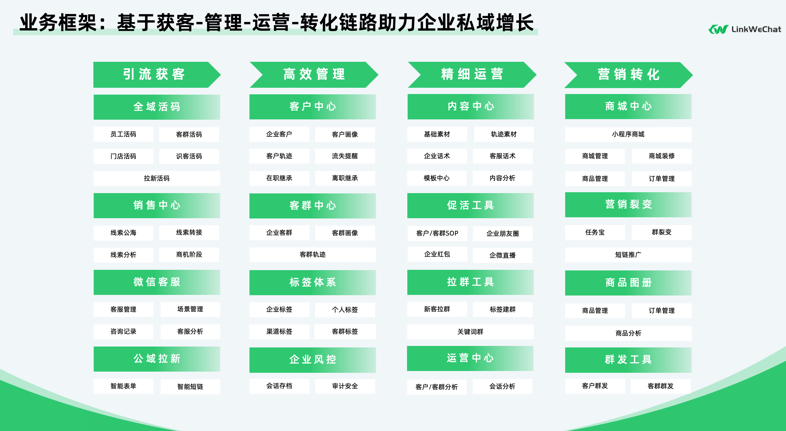
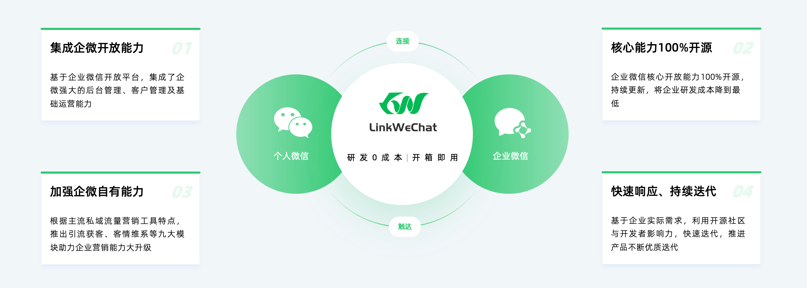
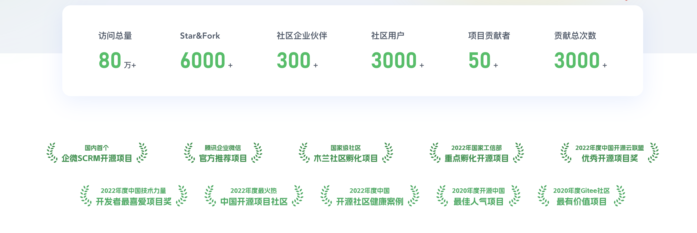

<p></p>
<p></p>


<div align="center">

[](https://gitee.com/LinkWeChat/link-wechat/stargazers)
[](https://gitee.com/LinkWeChat/link-wechat/members)
[](https://www.yuque.com/linkwechat/help/ci1n9p)
[](https://gitee.com/LinkWeChat/link-wechat/blob/master/LICENSE)
[](https://portal.mulanos.cn//)

[项目手册](https://www.yuque.com/linkwechat/help) | [用户手册](https://docs.qq.com/pdf/DZUpLbEVZR3RLdmxO?) | [常见问题](https://www.yuque.com/linkwechat/help/qk5gl6) 

</div>

<p></p>
<p></p>
<p></p>
<p></p>

---

**<p align="center">LinkWeChat 采用前后端分离架构，前端项目请点击<a href="https://gitee.com/LinkWeChat/link-we-chat-front" target="_blank">LinkWeChat-Front</a></p>**


**<p align="center">如果您觉得我们的开源项目很有帮助，请点击 :star: Star 支持 LinkWeChat 开源团队:heart:</p>**

---


# 一、 关于 LinkWeChat

## 1.1 介绍

> LinkWeChat, Link to WeChat.

LinkWeChat 是基于企业微信的开源 SCRM 系统，是企业私域流量管理与营销的综合解决方案。

LinkWeChat 基于企业微信开放能力，不仅集成了企微强大的后台管理及基础的客户管理功能，而且提供了多种渠道、多个方式连接微信客户。并通过客情维系、聊天增强等灵活高效的客户运营模块，让客户与企业之间建立强链接，从而进一步通过多元化的营销工具，帮助企业提高客户运营效率，强化营销能力，拓展盈利空间。

主要运用于电商、零售、教育、金融、政务等服务行业领域。

[更多 LinkWeChat 的故事](https://www.yuque.com/linkwechat/help/dsatfs)

## 1.2 能力

LinkWeChat SCRM 基于企业私域流量营销闭环，遵从获取新客到管理并维护客户，再到建立社群进行客户营销，最后在营销过程中再次获取新客的循环流程。



整个系统共分为十大模块：

*   **运营中心** ：客户、客群、会话等全功能数据报表，数据一目了然；
*   **引流获客** ：活码、群活码、公海、客服等多渠道引流，实现精准获客；
*   **销售中心** ：承接引流获客模块客户线索，高效协作跟进；
*   **客户中心** ：助力企业搭建私域流量池，高效运营客户；
*   **客群中心** ：客群运营场景全覆盖；
*   **客情维系** ：企业客户运营精细化，朋友圈、红包工具提高客户活跃度；
*   **内容中心** ：搭建企业自有内容库，多类型素材一键调用；
*   **全能营销** ：提供多类型、多场景客户营销工具；
*   **企业风控** ：会话合规存档，敏感内容全局风控；
*   **管理中心** ：组织架构、自建应用全融合，实现“一个后台”；

[LinkWeChat 社区版 V5.x 详细功能清单](https://docs.qq.com/sheet/DZWNxelVoT2VSU1V6?tab=BB08J3)

我们欢迎感兴趣的贡献者积极参与 LinkWeChat 新版的开源中，如有兴趣通过下方的联系方式联系我们哦~

## 1.3 优势

LinkWeChat 基于企业微信从服务内部到对外全面开放能力，可为电商、零售、教育、金融等垂直场景提供企微私域管理基础架构，主要优势有：

* 全面对接企微开放 API，无需重复对接，快速上手
* 二次整合封装企微 API，避免重复踩坑
* 采用主流 Java 架构，具备高拓展性、灵活性，避免 PHP 架构的缺点
* 对外提供内部 API，低成本二次开发



## 1.4 愿景

LinkWeChat 不做私域营销专家，而是通过开源让每个企业都是自己的私域流量营销专家：

* 集成企业微信基础能力，拿来即用
* 针对垂直行业提供一站式营销解决方案
* 开放自身平台能力，让更多的开发者参与进来
* 与企业微信共同助力企业数字化转型

# 二、关于项目


## 2.2 系统架构

LinkWeChat 自 V3.0 起架构升级，全面升级为微服务架构，整体系统架构如下：


## 2.3 技术栈

本项目基于 [RuoYi-Cloud](https://gitee.com/y_project/RuoYi-Cloud) 后台开发框架，感谢 [RuoYi-Cloud](https://gitee.com/y_project/RuoYi-Cloud) 的开源。

* 前端技术栈：ES6、Vue、Vuex、Vue-router、Vue-cli、Axios、Element-ui；
* 后端技术栈：Spring Boot、Spring Cloud & Alibaba、Nacos、Mybatis-plus、xxljob、RabbitMQ、Forest；

## 2.4 项目结构

**后端结构**

```
├── linkwe-api                // 系统业务接口模块
├── linkwe-auth               // 角色权限部门用户认证等模块
├── linkwe-common             // 公共组件模块
├── linkwe-fileservice	      // 文件服务模块
├── linkwe-framework	      // 框架配置
├── linkwe-gateway            // 网关服务
├── linkwe-scheduler	      // 定时任务相关模块
├── linkwe-service            // 系统service层抽取,与数据库相关交互
├── linkwe-wecome             // 企微接口实现
├── linkwe-wx-api             // 系统中设计微信公众号相关接口模块

```

**前端结构**

```
├── linkwe-pc			// 后台项目
├── linkwe-mobile		// 移动端项目包含移动工作台、任务宝、群裂变等H5
├── linkwe-uniapp		// uniapp短链小程序项目
```

## 2.5 项目部署

点击下方链接进入官方语雀帮助手册查看项目部署方式：

[帮助手册——如何快速部署 LinkWeChat](https://www.yuque.com/linkwechat/help/gt1myw)

建议服务器最低配置：

| 类型 | 配置 |
|:-:|:-:|
|操作系统|CentOS8.2|
|CPU|4核|
|内存|16G|
|带宽|5M|
|硬盘|100G|

# 三、常见问题

由于 LinkWeChat 项目基于企业微信官方第三方应用开发文档，所以请各位小伙伴在学习和使用 LinkWeChat 之前， **务必仔细了解并熟悉** 官方 API 已有功能。

[企业微信-企业内部开发-API 文档](https://open.work.weixin.qq.com/api/doc/90000/90003/90556)

点击下方链接进入官方语雀帮助手册查看常见问题的相关描述及更多帮助：

[帮助手册——常见问题](https://www.yuque.com/linkwechat/help/qk5gl6)

# 四、最近更新

## V5.0 更新日志

- [x] 系统UI全面调优，支持自定义；
- [x] 新增销售中心：线索公海自动分配，员工协作跟进；
- [x] 新增外链类素材：支持外部链接轨迹记录；
- [x] 新增客群去重：一键查询重复入群客户，提醒员工；
- [x] 新增代客下单：手动添加订单信息，识别转化客户；
- [x] 新增客服问答库：建立企业知识中心，客服自动智能回复；
- [x] 新增默认欢迎语：保证每个新客户都有企业自定义欢迎语；
- [x] 新增获客助手：官方链接，一键获取新客户；
- [x] 重构新客拉群/标签建群/关键词群，更符合业务场景；
- [x] 优化客户/客群裂变，支持卡片分享；
- [x] 优化员工/客群活码，分享更快捷，统计更强大；
- [x] 优化智能短链使用流程；
- [x] 优化微信客服升级服务；
- [x] 优化客群活码，支持无限群活码；
- [x] 优化企微群发相关逻辑；
- [x] 优化客户SOP/客群SOP相关功能；
- [x] 优化企业朋友圈相关功能；
- [x] 优化会话存档&敏感词相关功能；
- [x] 修复了一些已知问题；
- [x] 其余各模块UI细节调优。

点击下方链接进入官方语雀帮助手册查看历史版本更新日志：

[帮助手册——历史更新](https://www.yuque.com/linkwechat/help/pcmd0o)

# 五、奖项荣誉

LinkWeChat 凭借着出色的产品能力和专业的技术能力，已经获取如下奖项：



目前 LinkWeChat 已成功加入木兰开源社区孵化项目，得到了更加专业的技术支持与相关知识产权扶持，未来将会以更加严谨规范的专业能力服务各企业与行业。


**<p align="center">如果您觉得我们的开源项目很有帮助，请点击 :star: Star 支持 LinkWeChat 开源团队:heart:</p>**

---
